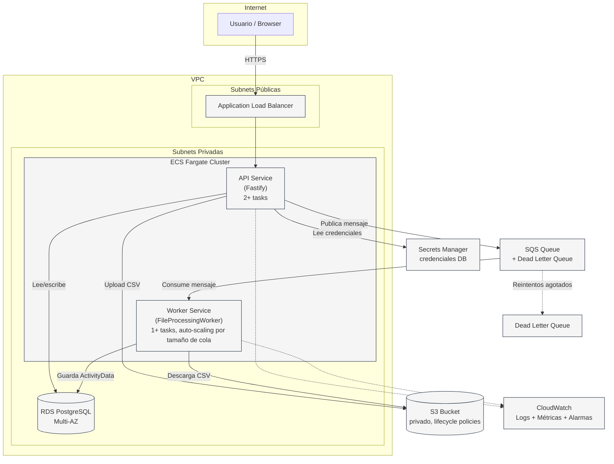

# Diagrama de Arquitectura AWS — CSV-PROCESING

Arquitectura de referencia para desplegar el sistema en AWS en producción
(el desarrollo local usa Docker Compose con PostgreSQL + LocalStack como
sustituto de RDS/S3/SQS).

## Diagrama (Mermaid)

## Componentes

| Componente | Rol |
|---|---|
| **VPC** con subnets públicas/privadas | Aísla la red; el ALB vive en subnets públicas, ECS y RDS en privadas |
| **Application Load Balancer (ALB)** | Recibe el tráfico HTTPS del frontend y lo enruta al servicio API |
| **ECS Fargate — API Service** | Corre el backend Fastify en contenedores sin servidor, 2+ tasks para alta disponibilidad |
| **ECS Fargate — Worker Service** | Corre `FileProcessingWorker`, escala automáticamente según el tamaño de la cola SQS (`ApproximateNumberOfMessagesVisible`) |
| **RDS PostgreSQL (Multi-AZ)** | Base de datos administrada con failover automático, en subnets privadas |
| **S3 Bucket** | Almacena los CSV subidos; privado, con lifecycle policy (ej. mover a Glacier tras 90 días) |
| **SQS Queue + DLQ** | Desacopla la subida del procesamiento; los mensajes que fallan repetidamente van a la Dead Letter Queue para inspección manual |
| **Secrets Manager** | Guarda las credenciales de RDS; ni el API ni el Worker las tienen hardcodeadas |
| **CloudWatch** | Logs centralizados de ambos servicios ECS + métricas + alarmas (ej. cola creciendo, tasks caídas) |

## Flujo end-to-end

1. El usuario sube un CSV desde el frontend (Next.js, fuera de esta VPC — típicamente en Vercel o Amplify) vía HTTPS al ALB.
2. El **API Service** guarda el archivo en **S3**, crea el registro `Upload` en **RDS** (`PENDING`) y publica un mensaje en **SQS**.
3. El **Worker Service** consume el mensaje, descarga el archivo de **S3**, lo parsea y valida, guarda las filas válidas como `ActivityData` en **RDS**, y actualiza el `Upload` a `COMPLETED`/`FAILED`.
4. Si el worker falla repetidamente procesando un mensaje, SQS lo mueve a la **DLQ** tras el número de reintentos configurado, evitando un loop infinito.
5. Ambos servicios envían logs y métricas a **CloudWatch** para observabilidad.

## Correspondencia con el entorno local

| AWS (producción) | Local (Docker Compose) |
|---|---|
| RDS PostgreSQL | Contenedor `postgres:16-alpine` |
| S3 | LocalStack (`STORAGE_DRIVER=s3`) o filesystem local (`STORAGE_DRIVER=local`) |
| SQS | LocalStack (`MESSAGE_QUEUE_DRIVER=sqs`) o mock en memoria (`MESSAGE_QUEUE_DRIVER=mock`) |
| ECS Fargate (API/Worker) | `npm run dev` / `npm run worker` en dos terminales |
| Secrets Manager | Variables de entorno en `.env` |
